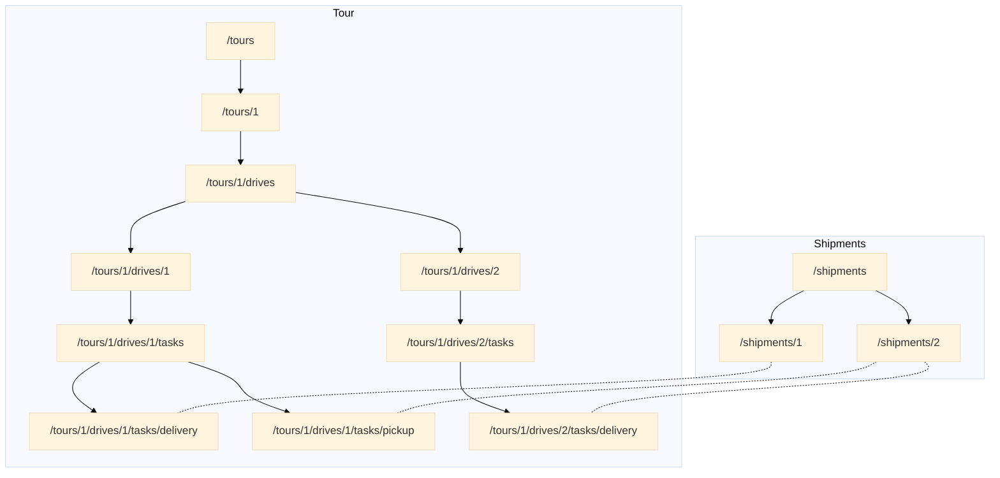
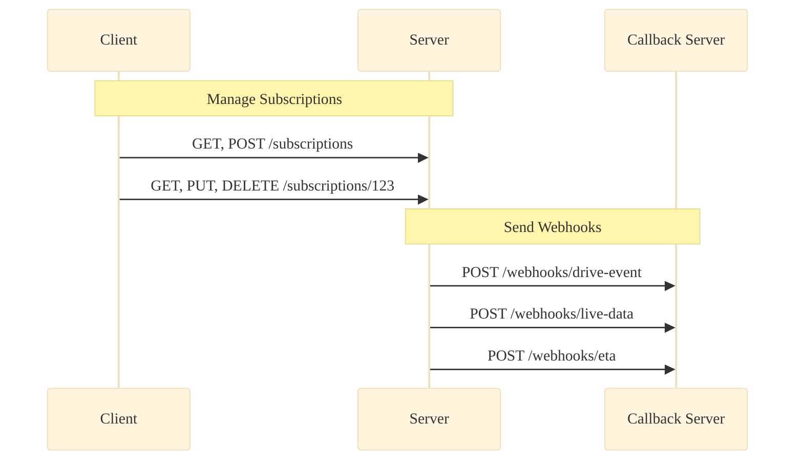

# API Sections

## Live Data

You can retrieve the latest data or a history of datasets within a specified time interval. The data consists of: 

- Position and movement data
- FMS data 
- Sensor data

## ETA
You can retrieve the latest ETA or a history of ETAs within a specified time interval. An ETA data set consists of an actual ETA for the corresponding drive and a time window for estimated deviations in conjunction with a confidence level. 

## Tour Management  

A tour consists of a number of drives. 

### Drive

A drive has a target address, time windows for starting and arrival times, a list of tasks, that must be carried out at the certain target address and information about dangerous goods that are loaded during the drive. The start of a tour is also a drive.

### Shipments

A shipment contains a list of items and a list of all relevant addresses (e.g. invoice or customer address). A shipment refers to a number of tasks that process it. 

### Items

An item has an `item_id` and a `parent_id`, so it is possible to represent a tree structure (e.g. a pallet of boxes with hard drives inside that all have their own ids). It also has detailed information about dimensions, codes (e.g. barcodes) and dangerous goods.

### Tasks

A task has a custom defined `task_type` (e.g. "delivery"), a further `address`, for example special coordinates on a factory site where it must be carried out at, and a `time_window`. There is also a list of generic key-value pairs so that it is also possible to define complex custom tasks. A task has a `shipment_uri` to a corresponding shipment to be processed.

## Tacho Files
To transmit tacho files (e.g. DDD files).

## Objects, Shipments, Drivers and customer
Endpoints for retrieving and managing resources that can be referenced in the various API sections. 

## Events

With events all the real-time data and status information can be transmitted. They can be retrieved as a list from a filtered endpoint (e.g. get all new drive events with the correct time in the `from` parameter from the `/drive-events` endpoint) or pushed asynchronously via [webhooks](generalConcepts.md#Callbacks). You can manage the webhooks to be sent with subscriptions. Each event type has a different list of enums for the actual event description. The task event has additional lists for status infomation of the associated shipment and its items (e.g. item condition at delivery).

## Messages
For sending messages to or retrieving messages from a channel. It is also possible to subscribe to a specific channel and get the messages directly via webhook.

## Subscriptions
To manage [subscriptions](generalConcepts.md#Callbacks) to various events.
## Webhooks
The different [webhook](generalConcepts.md#Callbacks) requests.
