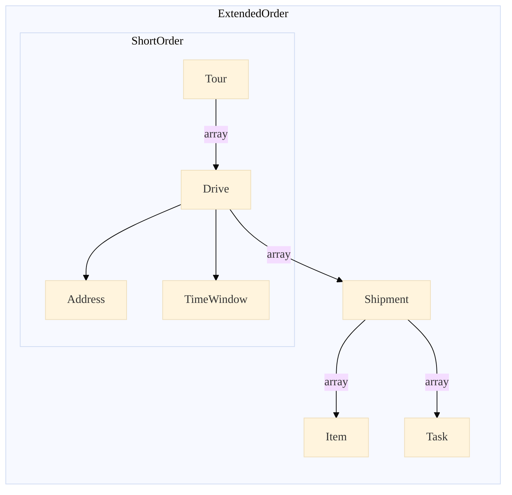
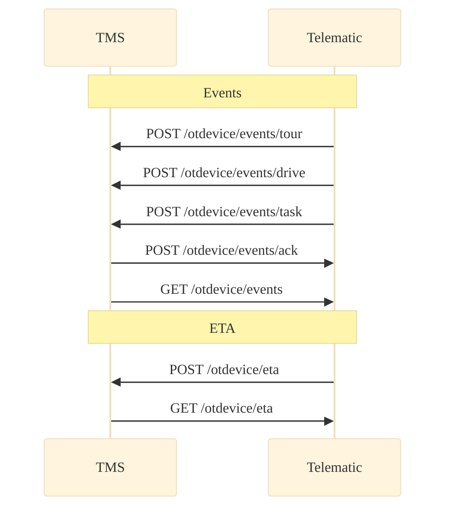

# API Sections

## Live Data

You can retrieve the current data or a history of datasets within a specified time interval. The data consists of: 

- Position and movement data
- Driver and passenger information
- CAN and FMS data 
- Diagnostic trouble codes (DTC)
- Temperature data
- IO status
- Driver behaviour

## Tour Management

There are two structures for tour management: `ShortOrder` and `ExtendedOrder`. `ShortOrder` is a subset of `ExtendedOrder`. They contain all static information about a tour. They can be updated (e.g. a drive can be added to a tour). Dynamic and not predictable information can be transmitted with [events](https://opentelematics.gitlab.io/otdata/docs/#/apiSections?id=events-and-eta). 

Simplified Structure:

A `tour` consists of a number of `drives`. 

### Drive

A drive has a target address and time windows for starting and arrival times. The `ExtendedOrder` structure has additionally a list of shipments, that need to be processed at the certain target address and information about dangerous goods that are loaded during the drive. The start of a tour is also a `drive`.

### Shipments

A shipment has a fixed list of items and a list of tasks to be completed at the end of the drive. 

### Items
 An item has an `id` and a `parentID`, so there is the possibility to represents a tree structure (e.g. a pallet of boxes with hard drives inside that all have their own ids). It also has detailed information about dimensions, codes (e.g. barcodes) and dangerous goods.

### Tasks

A task has a custom defined `tasktype` (e.g. "delivery"), a further `address` if it for example must be carried out at special coordinates on a factory site and a `timewindow`. There is also a list of generic key-value pairs so that it is also possible to define complex custom tasks.

### Events and ETA

Events can be retrieved as a list (e.g. from a queue of all new and not yet downloaded events) or pushed individually. There are different kinds of events: Tour, drive and task events. Every kind of event has a `timestamp`, `coordinates` and refers to a drive and a tour. There is also an additional list of generic key-value pairs for custom content. The event types have different lists of enums for the actual event description. The task event has additional lists for status infomation of the associated shipment and its items (e.g. item condition at delivery).
You can acknowledge events if they are successfully transmitted.  

`ETA` consists of an actual `eta`for the target address and a timewindow for estimated deviations.
You can push lists of ETAs for drives or retrieve a list of ETAs for a single or all drives in a tour.  

## Tacho

You can transmit tacho data (e.g. DDD files) and retrieve information about registered drivers and vehicles.  
It is also possible to get information about activities, working periods and vehicle usage of drivers.