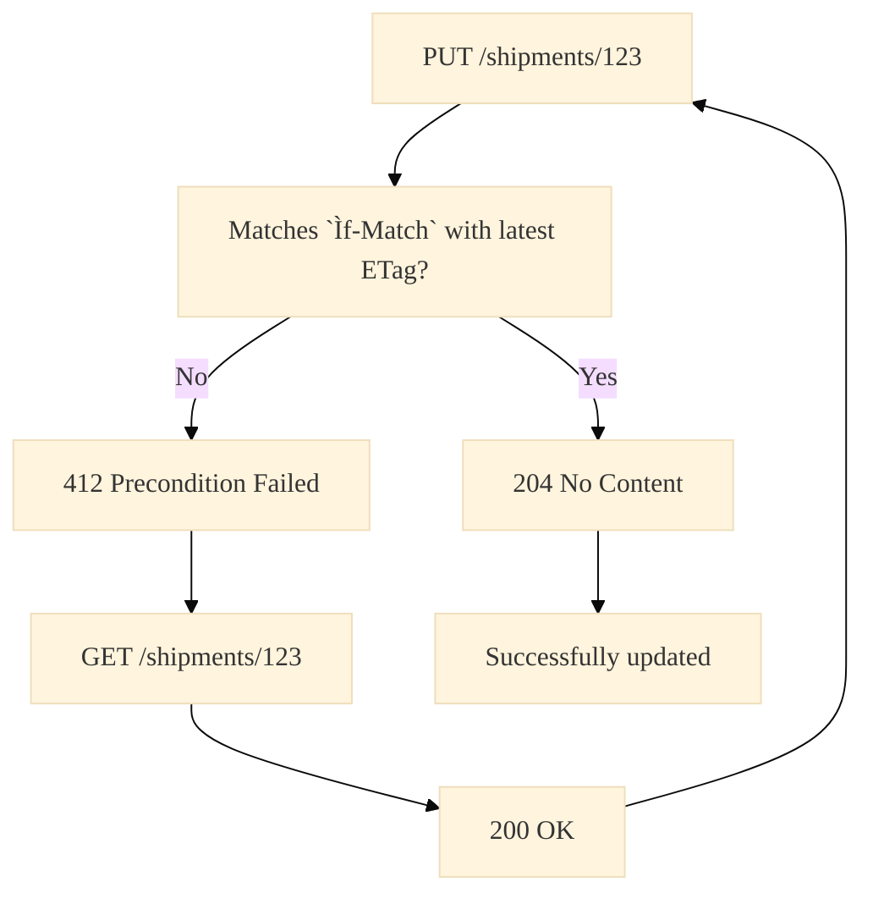

# General concepts
## Endpoint structure
The typical endpoint in the OTData API has always the same structure: 

| Request                 | Use                                                                   | Cacheable | Description                                  |
|-------------------------|-----------------------------------------------------------------------|-----------|----------------------------------------------|
| GET `/shipments`        | Search a collection with filters                                      | No        | Response can be returned in pages ([pagination](#cursor-based-pagination)).  Caching is not useful here, because of the filtering and pagination.            |
| POST `/shipments`       | Create a new resource                                                 | Yes       | ID, URI and links are assigned by the server. |
| GET `/shipments/123`    | Retrieve a certain resource                                           | Yes       |                                              |
| PUT `/shipments/123`    | Create a new resource or replace an existing with the request payload | No        | ID, URI and links are assigned by the client. |
| DELETE `/shipments/123` | Delete a certain resource                                             | No        |                                              |

## Naming conventions
| Content Type        | Naming Convention| Example|
|---------------------|------------------|------------------|
| OAS abstractions, fields  in data structures, query  and path parameters| snake_case | `good_example` | 
| Custom header               | Capitalized and Kebab-Case  as is the case with almost  all HTTP standard headers | `API-Version` |
| Endpoints          | lowercase and kebab-case | `/live-data` |

## URI in addition to IDs
The use of URIs leads to a much more understandable documentation without the need for external information, because path templating is not mandatory. You can directly make a GET request on a returned URI instead of combining the returned IDs with a specified path template to a valid URI. In addition, for example, customer data can be managed on another server and the exact endpoint can be explicitly specified with a URL (subtype of URI), which is not possible via IDs and local path templating. 

## ETag header
The [HTTP ETag header](https://datatracker.ietf.org/doc/html/rfc2068#section-14.20) is used to maintain data integrity when editing resources and to enable caching. Each resource has an ETag assigned by the server. The ETag changes in the moment the server modifies the resource.
### Optimistic concurrency control
To avoid data loss when editing a resource, the OTData API uses optimistic concurrency control. Pessimistic concurrency control is not necessary, due to the mostly low collision and locking probability.  
An [`If-Match` header](https://datatracker.ietf.org/doc/html/rfc7232#section-3.1) with the latest known ETag is sent along with a PUT or DELETE request. If the ETag of the resource has not been changed and the client therefore knows the latest instance of the resource, the server can proceed processing the request. If the latest ETag differs from the `Ìf-Match` header, the server returns a `412 Precondition Failed` status code. The client must then make a GET request to the resource and start the editing from the beginning with the new resource instance and the new ETag. If the latest ETag matches the `Ìf-Match` header, the server returns a `204 No Content` status code. The resource was successfully updated.  
This process guarantees optimistic concurrency control.

### Caching
When retrieving a certain resource and an instance of it is already known, an [`If-None-Match` header](https://datatracker.ietf.org/doc/html/rfc7232#section-3.2) with the latest known ETag can be sent along with the GET request. If the ETag of the resource has not been changed and the client therefore knows the latest instance of the resource, the server just returns a `304 Not Modified` status code without body. The client can use its local instance. If the ETag of the resource has been changed, the server returns `200 OK` along with the resource instance in the response body.  
This Caching with ETag headers reduces latency, since the server only needs to look up the ETag, and bandwith because the response body can be omitted in many cases.

## Callbacks
### Webhooks
To push data asynchronously from the server to the client, so-called webhooks are used. They are defined as POST requests and can transmit, for example, events, ETAs or generic messages to a `callback_url`.
### Publish–subscribe pattern
The `callback_url` and which webhooks to send, can be defined out-of-band or managed with the `/subscriptions` endpoint in a typical publish-subscribe pattern. With the subscription, the client can specify the `callback_url`, an `access_token`, to use within the webhook request, the `topic` (e.g. `tour_event`) to subscribe to and its `expiration_time`. Every time something is published to a topic, the clients that are subscribd to it receive the corresponding webhook request. If a webhook request is not successful, it may be retried. In addition to the callbacks, there are endpoints that can be used to retrieve all the events of the different topics via GET request.

## Cursor-based pagination
We use cursor-based pagination (also known as keyset pagination) because it has some advantages over offset-based pagination. There is no page drifting when new datasets are added between two requests and it scales well with a large number of datasets respectively large offsets.  
The `limit` parameter sets the desired number of datasets to be returned in the response. With each response of the server it returns a `next_cursor` field, that should be used as `cursor` parameter in the next request. If there are no more datasets, the `next_cursor` field is empty.  

## application/problem+json MIME type
As defined in [RFC7807](https://datatracker.ietf.org/doc/html/rfc7807). It is used as media type of error responses (HTTP status codes 4xx and 5xx) to provide details about the occurred error in machine- and human-readable form.
